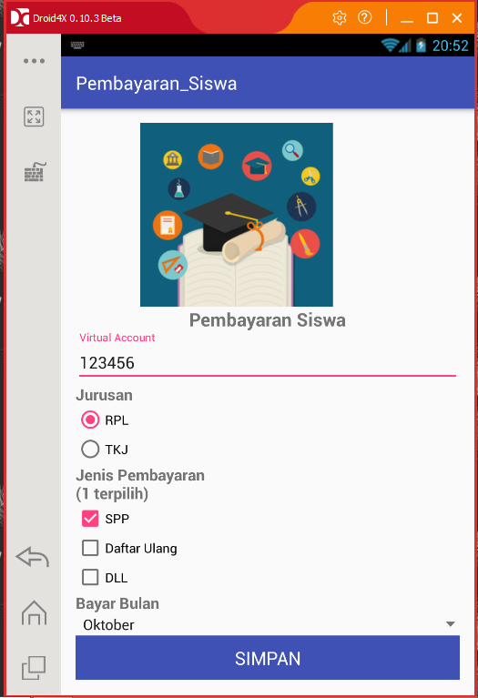
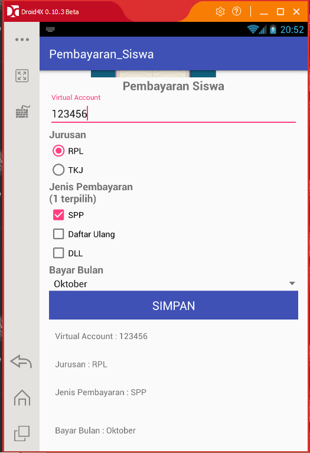

# TUGAS-001
***
Tema atau topik form isian yang saya buat adalah form isian untuk pembayaran siswa.
Dalam pengisiannya yaitu terdapat input data virtual account, jurusan, jenis pembayaran,
dan juga pilihan untuk memilih bulan saat pembayaran.Kegunaannya adalah memudahkan siswa
untuk melakukan pembayaran biaya pendidikannya. Deteksi kesalahan dalam form isian ini adalah
apabila data virtual account yang dimasukkan tidak mencapai 6 karakter maka ada peringatan ("Penulisan Tidak Valid!(Min. 6 Karakter").
  

  
link apk : https://drive.google.com/open?id=0B9lWfpOYSZyFSWRqekFfeTkzMGs
 
***
NINA WULANSARI / XII RPL 4 / 24 / 4401/1299-070 / SMK TELKOM MALANG
